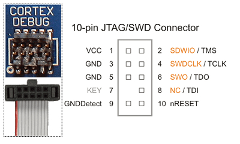
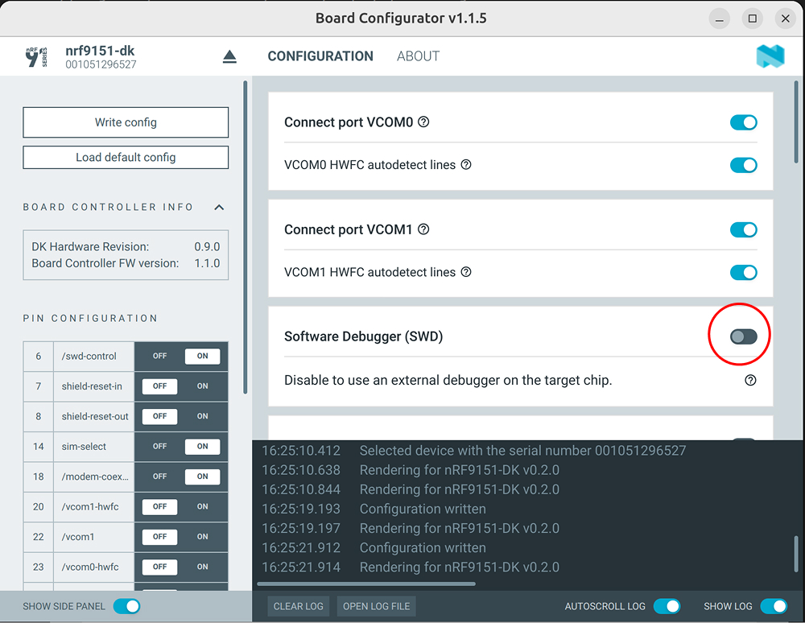
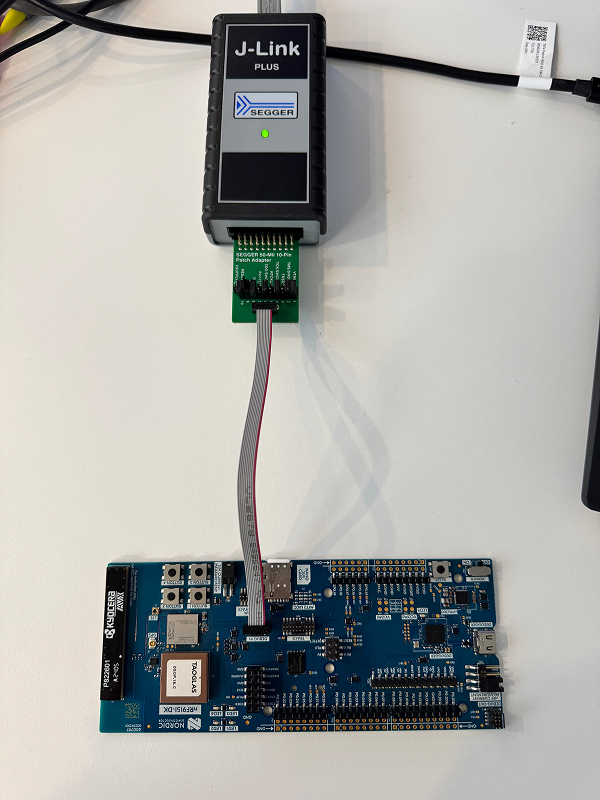

# J-Link External Probe Flash & Debug Guide for nRF9151

The nRF9151 DK includes an on-board J-Link debugger for evaluation and development.
This embedded debugger is specific to the DK, on a custom production board,
there is no on-board debugger, so an external SWD debug probe (typically a J-Link)
is required to program and debug the device.

This guide explains how to use an external
J-Link probe both on the DK and on custom boards.

---

## Prerequisites

- **SEGGER J-Link Software**:  Download from
  [segger.com/downloads/jlink](https://www.segger.com/downloads/jlink/)
- **nRF Connect SDK toolchain**: Follow the
  [Getting Started](https://docs.nordicsemi.com/bundle/ncs-latest/page/nrf/installation/install_ncs.html) guide

---

## Hardware Connector & Pinout

### J-Link 20-pin ARM JTAG/SWD Connector (standard)

The external J-Link probe uses a **20-pin** connector on its end.
For SWD, only a subset of pins are used:

```
SWD minimum wiring:
  Pin  1 → VREF
  Pin  2 → SWDIO
  Pin  4 → SWCLK
  Pin  9 → GND
  Pin 10 → nRESET
```

### nRF9151-DK Debug In Header (`P18`)

`P18` is a **10-pin** Cortex Debug connector on the DK.



Use a [50-Mil 10-Pin Patch Adapter](https://www.segger.com/products/debug-probes/j-link/accessories/adapters/segger-50-mil-10-pin-patch-adapter/)
or a dedicated Cortex-Debug 10-pin cable that mates directly with a
J-Link Mini / J-Link Base that also ships with a 10-pin connector.

---

## Disabling the On-Board J-Link OB on the DK

**This step is only required if the DK is powered via the interface USB cable (`J2`).**
When powered through USB, the on-board J-Link OB is active and will conflict
with the external probe, both would drive the SWD lines simultaneously.

If the DK is powered exclusively through the external J-Link's Vsupply
(i.e. the interface USB cable is **not** connected), the on-board debugger is
inactive and you can skip this step entirely, the `P18` Debug In connector is
designed for exactly this use case.

To disable it, open the **Board Configurator** tool
(available in [nRF Connect for Desktop](https://www.nordicsemi.com/Products/Development-tools/nRF-Connect-for-Desktop))
and toggle the **SWD** option to disconnect the on-board J-Link.



---

## Connecting the J-Link Probe



- Connect the J-Link probe to the **Debug In header (`P18`)** on the DK.
- Connect the J-Link probe to the host PC via USB.
- Verify that the probe is detected:

```bash
JLinkExe -device nRF9151_xxCA -if SWD -speed 4000
```

Expected output:

```
SEGGER J-Link Commander V9.16a (Compiled Feb  6 2026 12:41:57)
DLL version V9.16a, compiled Feb  6 2026 12:40:50

Connecting to J-Link via USB...O.K.
Firmware: J-Link V13 compiled Feb  6 2026 17:12:48
Hardware version: V13.00
J-Link uptime (since boot): 0d 00h 03m 45s
S/N: 603007163
License(s): RDI, FlashBP, FlashDL, JFlash, GDB
USB speed mode: High speed (480 MBit/s)
VTref=1.806V


Type "connect" to establish a target connection, '?' for help
J-Link>
```

Then type connect to establish the target connection:

```
J-Link>connect
Device "NRF9151_XXCA" selected.

Connecting to target via SWD
...
Cortex-M33 identified.
J-Link>
```

---

## Erasing the Device with JLinkExe

```bash
JLinkExe -device nRF9151_xxCA -if SWD -speed 4000 -autoconnect 1
```

**To erase internal flash only:**
```
J-Link> erase
...
Erasing done.
J-Link>
```

**To erase both internal and external flash:**
```
J-Link> exec EnableEraseAllFlashBanks
J-Link> erase
...
Erasing done.
J-Link>
```

---

## Flashing a Firmware Image (merged.hex)

`merged.hex` is the combined HEX image produced by the nRF Connect SDK build system.
It typically bundles the **bootloader** and the **application** into a single file.

```bash
JLinkExe -device nRF9151_xxCA -if SWD -speed 4000 -autoconnect 1
```

```
J-Link> loadfile /path/to/build/merged.hex
...
J-Link: Flash download: Program speed: 240 KB/s
O.K.
J-Link> r          # Reset the target
J-Link> g          # Go (start execution)
J-Link> exit
```

---

## Debugging with JLinkGDBServer and GDB

Debugging requires two terminals running simultaneously.

### Terminal 1 — Start the GDB Server

```bash
JLinkGDBServer -device nRF9151_xxCA -if SWD -speed 4000 -port 2331
```

Leave this terminal open. You should see:

```
SEGGER J-Link GDB Server V9.16a Command Line Version
...
Connected to target
Waiting for GDB connection...
```

### Terminal 2 — Launch GDB

```bash
arm-none-eabi-gdb /path/to/build/zephyr/zephyr.elf
```

Inside GDB:

```gdb
# Connect to the GDB server
(gdb) target remote localhost:2331

# Reset the CPU before the first instruction
(gdb) monitor reset halt

# Set a breakpoint
(gdb) break main

# Start execution
(gdb) continue
```

From here, use standard GDB commands to step through code, inspect variables,
read registers, set watchpoints, etc.

### Alternative — Using `west debug`

Instead of managing two terminals manually, `west` can launch the GDB server and
connect to it in one command:

```bash
west debug
```

If multiple J-Link probes are connected to the host (e.g. the DK is also plugged
in via USB alongside your external probe), specify the target probe explicitly:

```bash
west debug --runner jlink --dev-id <device-id>
```

Replace `<device-id>` with the J-Link serial number. To find it, run JLinkExe,
the serial number is printed at startup:

```
S/N: 603007163
```

